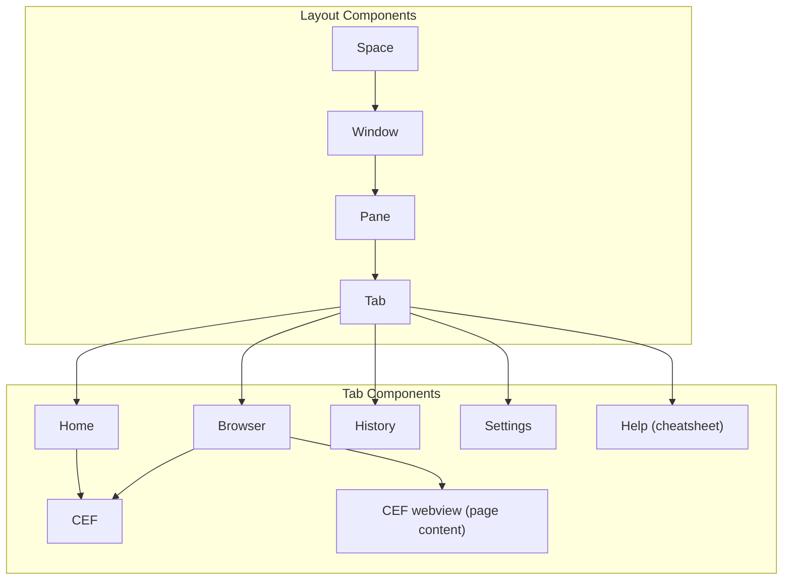
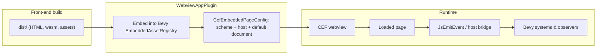

# Architecture

## What you should know

- [Bevy ECS](https://bevy.org/learn/quick-start/getting-started/ecs/): entity–component–system runtime that drives the native shell, scheduling, and how CEF webviews sit in the scene.
- [Dioxus](https://dioxuslabs.com/learn/0.7/): declarative Rust UI used for embedded surfaces (e.g. history) shipped as HTML/WASM inside the webview stack.

## Entity Design

## Webview App

`vmux_webview_app` serves a small front-end bundle over a custom `vmux://` scheme: assets under `dist/` are embedded into Bevy, CEF loads `index.html` for a named host. 

